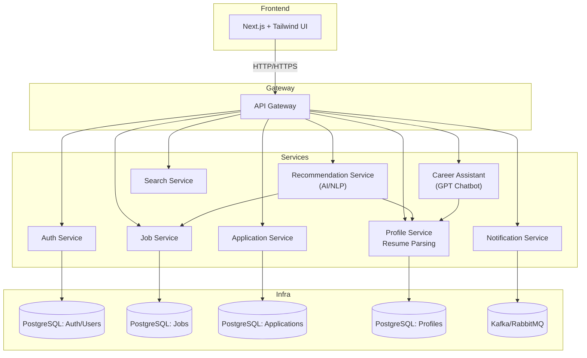

# Job Board Platform (Microservices)

A production-grade **Job Board Platform** built with **FastAPI**, **PostgreSQL**, and **microservice architecture**.  
The system is designed for scalability, security, and AI-powered recommendations.  

---

## 📦 Microservice Plan

| Service | Description | Tech Stack |
|---------|-------------|------------|
| **Auth Service** | User registration, login, JWT, refresh tokens, RBAC. | FastAPI, PostgreSQL, Redis |
| **Profile Service** | User profiles, resumes, parsing, enrichment. | FastAPI, PostgreSQL |
| **Job Service** | Job postings CRUD, filtering, search integration. | FastAPI, PostgreSQL |
| **Application Service** | Job applications, linking users ↔ jobs, employer views. | FastAPI, PostgreSQL |
| **Recommendation Service** | AI/NLP-driven job recommendations. | FastAPI, PyTorch/TF |
| **Career Assistant** | GPT-powered chatbot for career guidance. | FastAPI, LLM API |
| **Search Service** | Full-text + semantic search, filters, pagination. | FastAPI, Elasticsearch |
| **Notification Service** | Email/SMS/push notifications, async jobs. | FastAPI, Kafka/RabbitMQ |

---

## 🏗️ System Architecture

📚 Learning Focus

- This project isn’t just about building an application — it’s a hands-on learning lab for modern web, AI, and system design concepts:

- Microservice Architecture: Service boundaries, independent databases, event-driven design.

- Authentication & Security: JWT, RBAC, secure password hashing, role-based access control.

- Database Design: PostgreSQL schemas, indexing, relationships, migrations with Alembic.

- Advanced Queries & Pagination: Efficient filtering, search integration, complex joins.

- AI & NLP Integration: Resume parsing, embeddings, recommendation pipelines, GPT-powered chatbot.

- Frontend Integration: Next.js + Tailwind UI, API consumption, filters, dashboards.

- Deployment & Observability: Docker, Docker Compose, Kubernetes, CI/CD, monitoring/logging.

- Async & Event-driven Systems: Kafka/RabbitMQ for notifications, async task management.

🔮 Roadmap
MVP (Phase 1)

[] Auth & RBAC service

[] Job & Application services

[] Resume parsing in Profile service

[] Basic Search service

[] Frontend with job listings & filters

[] AI Features (Phase 2)

[] Recommendation service (embedding-based)

[] Career Assistant GPT chatbot

[] Resume parsing improvements with NLP

[] Production & Scaling (Phase 3)

[] Notification service (Email/SMS)

[]Event-driven architecture & async pipelines

[] Dockerized deployment + Kubernetes manifests

[] Observability (Prometheus/Grafana, logs, metrics)

[] CI/CD pipelines with automated tests

💡 Vision

TalentForge aims to empower job seekers and employers by combining AI and microservices.

For candidates → personalized matches, insights, and real guidance.

For employers → better candidate fit, less noise, higher hiring efficiency.