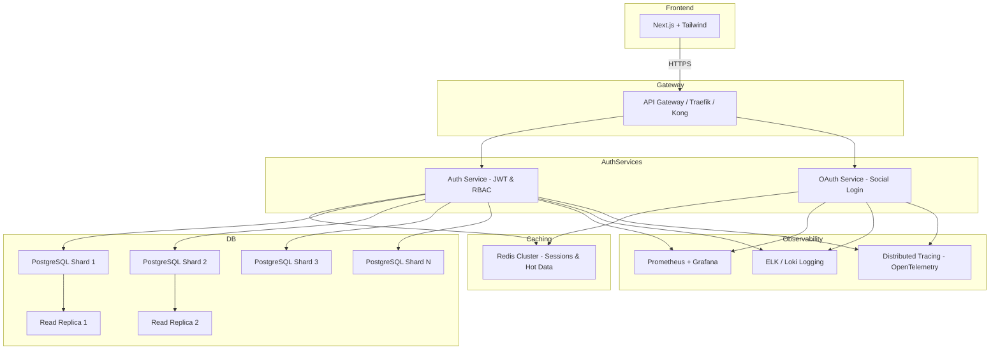
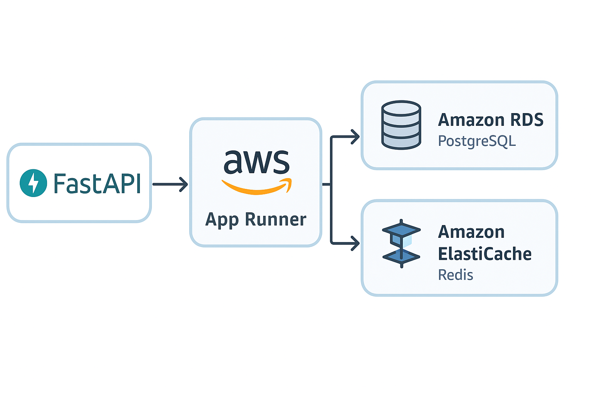

# Auth Service

The **Auth Service** is a production-ready microservice responsible for **user authentication, authorization, OAuth integration, and caching**.  
It is part of the TalentForge ecosystem and is built with **FastAPI, PostgreSQL, Redis, and Docker/Kubernetes deployment support**.

---

## 🏗️ High-Scale Architecture



## Project - Structure
```text
auth-service/
├── app/                        # Main application folder
│   ├── __init__.py             # Marks app as a Python package
│   ├── main.py                 # FastAPI entrypoint
│   ├── api/                    # API endpoints
│   │   ├── v1/                 # Version 1 of API
│   │   │   ├── __init__.py
│   │   │   ├── auth.py         # JWT login/logout, RBAC
│   │   │   └── users.py        # User registration, profile CRUD
│   │   └── v2/                 # Version 2 of API
│   │       ├── __init__.py
│   │       └── auth.py
│   ├── core/                   # Core utilities and configuration
│   │   ├── config.py           # Env settings
│   │   ├── security.py         # Password hashing, JWT helpers
│   │   ├── hashing.py          # Bcrypt password hashing
│   │   ├── logging.py          # Structured logging
│   │   ├── oauth.py            # OAuth2 client setup
│   │   └── redis_cache.py      # Redis connection & caching logic
│   ├── db/                     # Database layer
│   │   ├── base.py             # Base class for SQLAlchemy models
│   │   ├── models.py           # User, Role, Token tables
│   │   ├── schemas.py          # Pydantic request/response models
│   │   └── crud.py             # CRUD operations
│   ├── services/               # Business logic
│   │   ├── auth_service.py
│   │   └── user_service.py
│   ├── utils/                  # Helper utilities
│   │   ├── jwt.py              # JWT creation & validation
│   │   └── email.py            # Email verification / reset
│   └── tests/                  # Unit & integration tests
│       ├── test_auth.py
│       └── test_users.py
├── alembic/                     # DB migrations
│   ├── versions/                # Auto-generated migration scripts
│   └── env.py
├── infra/                       # Deployment & infrastructure
│   ├── Dockerfile
│   ├── docker-compose.yml
│   ├── traefik.yml
│   └── k8s/
│       ├── deployment.yaml
│       └── service.yaml
├── .env                         # Environment variables
├── pyproject.toml               # Project metadata & dependencies
├── requirements.txt
└── README.md

```

## ⚙️ Features

- JWT Authentication & Role-Based Access Control (RBAC)

- OAuth2 integration (Google, GitHub, etc.)

- Redis caching for tokens & frequently accessed data

- PostgreSQL with SQLAlchemy ORM & Alembic migrations

- Versioned API (v1, v2)

- Dockerized & Kubernetes-ready deployment

- Structured logging & unit tests for reliability

- Horizontal scaling & load balancing

## ✅ Production Checklist

### Architecture & Scalability

    [] Stateless Auth Service (JWT access, Redis refresh tokens)

    [] OAuth Service integration

    [] API Gateway for routing, TLS, HPA awareness

    [] Horizontal scaling via Kubernetes HPA

    [] Sharded PostgreSQL & read replicas

    [] Redis Cluster for session & hot data caching

    [] Asynchronous tasks (Celery/RabbitMQ/Kafka)

    [] Versioned APIs (v1, v2)

### Security

    [] Short-lived JWT access tokens & refresh tokens in Redis

    [] Role-Based Access Control (RBAC) enforced

    [] OAuth token validation & scope enforcement

    [] Brute-force protection (login throttling)

    [] Email/Phone verification

    [] Optional 2FA / MFA

    [] Secrets management (Vault / AWS Secrets Manager)

    [] TLS everywhere

    [] Encryption for sensitive DB fields

    [] Reliability & Availability

    [] Multi-region deployment

    [] Automatic failover for Redis/PostgreSQL

    [] Circuit breakers for downstream services

    [] Horizontal Pod Autoscaler (HPA)

    [] Load balancing (NGINX / Traefik)

    [] Rate-limiting per IP/user

### Observability

    [] Metrics via Prometheus

    [] Centralized logging (ELK / Loki)

    [] Distributed tracing (OpenTelemetry)

    [] Alerts for errors, high latency, unusual traffic

    [] Grafana dashboards for monitoring
### DevOps & Maintainability

    [] CI/CD pipelines

    [] Unit & integration tests

    [] Linting & code quality checks

    [] Alembic automated DB migrations

    [] Infrastructure as code (Terraform / Helm)

### API documentation (FastAPI OpenAPI)

    [] Feature flags for experimental flows

### Performance Optimizations

    [] Redis caching for frequent queries

    [] Connection pooling (DB + Redis)

    [] API response compression (gzip)

    [] Adaptive rate limiting

    []Query indexing & partitioning

[] Optional Advanced Features

    [] Global session store for multi-region failover

    [] ML for suspicious login detection

### CDN for frontend assets

    [] Auto-scaling background workers

## 🚀 Getting Started
### Clone repo
```bash
git clone https://github.com/your-username/auth-service.git
cd auth-service
```
### Install dependencies
```bash
uv sync
```
### Configure environment
```bash cp .env.example .env```
### Edit .env with your DB, Redis, and JWT secrets

### Run service locally
```bash uv run uvicorn app.main:app --reload --port 8001```

### Run tests
```bash uv run pytest```

# 🔥 Auth Service Production Checklist

## 1️⃣ Architecture & Scalability

 Stateless Auth Service (JWT access, Redis refresh tokens)

 OAuth Service integration (Google, GitHub, etc.)

 API Gateway / Traefik for routing, TLS termination, and HPA awareness

 Horizontal scaling via Kubernetes HPA

 Sharded PostgreSQL for user tables

 Read replicas for high-volume read queries

 Redis Cluster for session and hot data caching

 Asynchronous task queue (Celery / RabbitMQ / Kafka) for emails, analytics

 Versioned APIs (v1, v2)

## 2️⃣ Security

 Short-lived JWT access tokens & refresh tokens in Redis

 Role-Based Access Control (RBAC) enforced in APIs

 OAuth token validation and scope enforcement

 Brute-force protection (login attempt throttling)

 Email/Phone verification for new accounts

 Optional 2FA / MFA

 Secrets management via Vault or AWS Secrets Manager

 TLS everywhere (HTTPS endpoints + DB connections)

 Encrypt sensitive DB fields (passwords, tokens)

## 3️⃣ Reliability & Availability

 Multi-region deployment for low latency & redundancy

 Automatic failover for Redis and PostgreSQL clusters

 Circuit breakers on critical downstream services

 Horizontal Pod Autoscaler (HPA) in Kubernetes

 Load balancing (NGINX / Traefik / HAProxy)

 Rate-limiting per IP/user

## 4️⃣ Observability

 Metrics via Prometheus (requests/sec, latency, errors)

 Centralized logging (ELK / Loki)

 Distributed tracing with OpenTelemetry

 Alerts for errors, high latency, unusual traffic

 Dashboards (Grafana) for service health monitoring

## 5️⃣ DevOps & Maintainability

 CI/CD pipelines for automated testing & deployment

 Unit & integration tests (pytest)

 Linting & code quality checks

 Alembic for automated DB migrations

 Infrastructure as code (Terraform / Helm charts)

 Documentation for APIs (FastAPI OpenAPI)

 Feature flags for experimental flows

 Versioned API documentation & changelogs

## 6️⃣ Performance Optimizations

 Redis caching for frequent queries (profile, roles, tokens)

 Connection pooling (DB + Redis)

 API response compression (gzip)

 Adaptive rate limiting per user/region

 Sharded DB for write scalability

 Read replicas for heavy reads

 Query indexing & partitioning

## 7️⃣ Optional Advanced Features

 Global session store for multi-region failover

 Machine learning for suspicious login detection

 Logging of failed login attempts with anomaly detection

 CDN for static frontend assets (Next.js / Tailwind)

 Auto-scaling background workers for async tasks


## 🏠 Hosting Plan

<details>
<summary>1️⃣ Compute Layer (FastAPI App)</summary>

**Best Option:** AWS App Runner (Serverless Container)  

**Why:**
- ✅ Fully managed, scales automatically
- ✅ Supports async frameworks like FastAPI natively
- ✅ Deploy directly from GitHub or Docker image
- 🆓 Free tier: 750 hours/month + 1 GB storage

**Alternative:** AWS Lambda with Mangum adapter  
- Lower cost, but cold starts may affect performance
- App Runner is simpler for full-featured async apps
</details>

<details>
<summary>2️⃣ Database Layer (PostgreSQL)</summary>

**Best Option:** Amazon RDS (PostgreSQL Free Tier)  

**Why:**
- ✅ Fully managed DB (automatic backups, monitoring)
- 🆓 Free tier: 750 hours/month + 20 GB storage
- ✅ Easy integration with FastAPI async via asyncpg or SQLAlchemy AsyncSession

**Alternative for scalability:** Aurora Serverless v2  
- Pay-per-use for unpredictable load spikes
- Free-tier for 12 months sufficient for dev/test
</details>

<details>
<summary>3️⃣ Cache Layer (Redis)</summary>

**Best Option:** Amazon ElastiCache Redis (t2.micro / free tier)  

**Why:**
- ✅ Managed Redis with monitoring, persistence, and automatic failover
- 🆓 Free tier: 750 hours/month + 750 MB memory
- Perfect for async session caching, JWT blacklisting, or rate limiting

**Alternative:** Lightweight Redis on EC2/Lightsail  
- You’ll manage updates and backups manually
</details>

<details>
<summary>4️⃣ Networking & Security</summary>

- 🔒 Use AWS VPC to isolate RDS and Redis instances
- 🔒 Add security groups allowing App Runner/EC2 access only to DB and Redis ports
- 🔐 For HTTPS endpoints, App Runner or API Gateway provides SSL automatically
</details>

<details>
<summary>5️⃣ Recommended Stack for Free Tier + Production-like Dev/Test</summary>

| Layer        | Service            | Reasoning                                    |
|-------------|------------------|---------------------------------------------|
| FastAPI App | AWS App Runner     | Managed async, auto-scaling, free-tier hours |
| Database    | RDS PostgreSQL     | Managed, async-ready, 20GB free storage     |
| Cache       | ElastiCache Redis  | Managed, async-compatible, free-tier memory |
| Security    | VPC + Security Groups | Isolate DB/Redis, allow only App access  |


</details>
