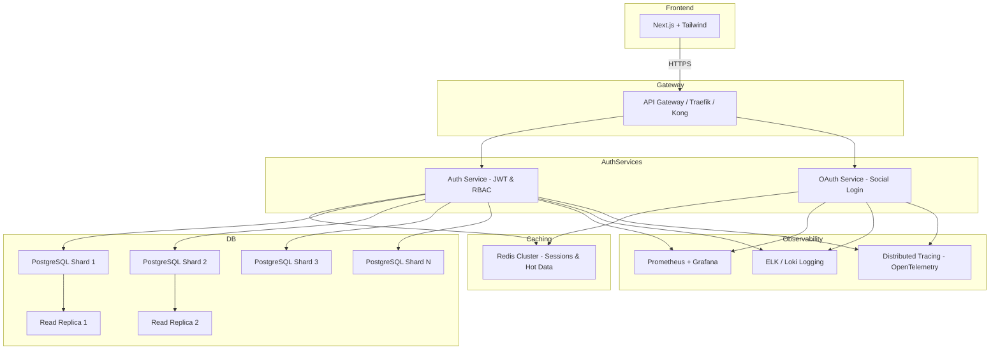

# Auth Service

The **Auth Service** is a production-ready microservice responsible for **user authentication, authorization, OAuth integration, and caching**.  
It is part of the TalentForge ecosystem and is built with **FastAPI, PostgreSQL, Redis, and Docker/Kubernetes deployment support**.

---


## 🏗️ High-Scale Auth Service Architecture



✅ Highlights of This Architecture

Frontend:

-Next.js + Tailwind for user interfaces.

- API Gateway:

    Handles routing, TLS, rate limiting, and HPA awareness.

- Auth & OAuth Services:

    Stateless, horizontally scalable microservices.

- JWT-based authentication + RBAC.

- Redis Cluster:

    Caches sessions, login attempts, and frequently accessed user metadata.

- Sharded PostgreSQL:

    Horizontal sharding to distribute 200M users across multiple DB clusters.

- Read replicas for heavy read queries.

-Observability:

    Prometheus + Grafana for metrics.

    ELK / Loki for logging.

    OpenTelemetry for tracing.

- Deployment:

    Kubernetes horizontal scaling.

    Multi-region clusters for low latency and failover.

## 📂 Project Structure

```plaintext
auth-service/
├── app/                        # Main application folder
│   ├── __init__.py             # Marks app as a Python package
│   ├── main.py                 # FastAPI entrypoint
│   ├── api/                    # API endpoints
│   │   ├── v1/                 # Version 1 of API
│   │   │   ├── __init__.py     # Aggregates all v1 routers
│   │   │   ├── auth.py         # Authentication endpoints (login, logout, JWT)
│   │   │   ├── users.py        # User registration, profile CRUD
│   │   │   └── health.py       # Health check endpoint (/health)
│   │   └── v2/                 # Version 2 of API (future upgrades)
│   │       ├── __init__.py
│   │       └── auth.py
│   ├── core/                   # Core utilities and configuration
│   │   ├── __init__.py
│   │   ├── config.py           # Environment settings, configs
│   │   ├── security.py         # Password hashing, JWT helper functions
│   │   ├── hashing.py          # Password hashing functions (bcrypt)
│   │   ├── logging.py          # Structured logging setup
│   │   ├── oauth.py            # OAuth2 client setup and validation
│   │   └── redis_cache.py      # Redis connection & caching logic
│   ├── db/                     # Database layer
│   │   ├── __init__.py
│   │   ├── base.py             # Base class for SQLAlchemy models
│   │   ├── models.py           # Database models (User, Role, Token)
│   │   ├── schemas.py          # Pydantic schemas for request/response
│   │   └── crud.py             # CRUD operations for the database
│   ├── services/               # Business logic layer
│   │   ├── __init__.py
│   │   ├── auth_service.py     # Authentication business logic
│   │   └── user_service.py     # User management business logic
│   ├── utils/                  # Helper utilities
│   │   ├── __init__.py
│   │   ├── jwt.py              # JWT creation and verification
|   |   |── response.py         # format response
│   │   └── email.py            # Email sending functions 
(verification/reset)
│   └── tests/                  # Test folder
│       ├── __init__.py
│       ├── unit/               # Unit tests
│       │   ├── __init__.py
│       │   ├── test_health.py
│       │   ├── test_auth.py
│       │   └── test_users.py
│       ├── integration/        # Integration tests
│       │   ├── __init__.py
│       │   └── test_auth_integration.py
│       └── e2e/                # End-to-end tests
│           ├── __init__.py
│           └── test_auth_e2e.py
├── alembic/                     # Database migrations
│   ├── versions/                # Auto-generated migration scripts
│   └── env.py                   # Alembic environment configuration
├── infra/                       # Deployment & infrastructure files
│   ├── Dockerfile               # Container image definition
│   ├── docker-compose.yml       # Local multi-container orchestration
│   ├── traefik.yml              # API Gateway / reverse proxy config
│   └── k8s/                     # Kubernetes manifests
│       ├── deployment.yaml      # Deployment configuration
│       └── service.yaml         # Service configuration for cluster
├── .env                         # Environment variables
├── pyproject.toml               # Project metadata & dependencies (uv)
├── requirements.txt             # Python dependencies (optional)
└── README.md                    # Project documentation


```
## ⚙️ Features

- JWT Authentication & Role-Based Access Control (RBAC)

- OAuth2 integration (Google, GitHub, etc.)

- Redis caching for tokens & frequently accessed data

- PostgreSQL with SQLAlchemy ORM & Alembic migrations

- Versioned API (v1, v2) for backward compatibility

- Dockerized & ready for Kubernetes deployment

- Structured logging & unit tests for reliability

## 🚀 Getting Started

### Clone the repository:
```bash
git clone https://github.com/git clone https://github.com/your-username/auth-service.git
cd auth-service

```

### Install dependencies using uv:
```bash
    uv sync
```


Configure .env with your database, Redis, and JWT secrets.

### Run the service locally:
```bash
uv run uvicorn app.main:app --reload --port 8000
```

### Run tests:
```bash
    uv run pytest
```


